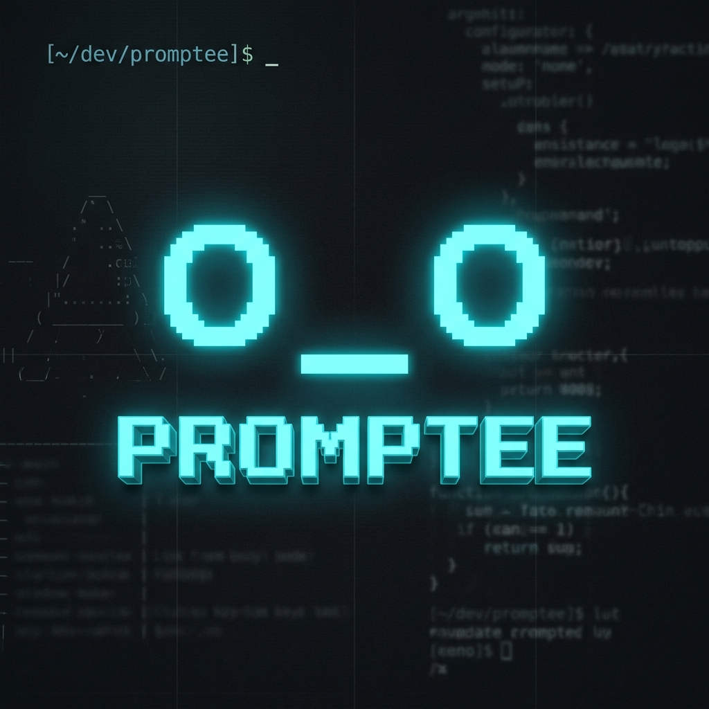

<p align="center">
  
</p>

```text
 /$$$$$$$                                               /$$                        
| $$__  $$                                             | $$                        
| $$  \ $$ /$$$$$$   /$$$$$$  /$$$$$$/$$$$   /$$$$$$  /$$$$$$    /$$$$$$   /$$$$$$ 
| $$$$$$$//$$__  $$ /$$__  $$| $$_  $$_  $$ /$$__  $$|_  $$_/   /$$__  $$ /$$__  $$
| $$____/| $$  \__/| $$  \ $$| $$ \ $$ \ $$| $$  \ $$  | $$    | $$$$$$$$| $$$$$$$$
| $$     | $$      | $$  | $$| $$ | $$ | $$| $$  | $$  | $$ /$$| $$_____/| $$_____/
| $$     | $$      |  $$$$$$/| $$ | $$ | $$| $$$$$$$/  |  $$$$/|  $$$$$$$|  $$$$$$$
|__/     |__/       \______/ |__/ |__/ |__/| $$____/    \___/   \_______/ \_______/
                                           | $$                                    
                                           | $$                                    
                                           |__/                                    
```

> A production-ready Local MLOps & RAG CLI built for terminal-based AI workflows.

**Promptee** is an open-source toolchain that bridges the gap between ad-hoc prompt engineering and production AI infrastructure. It provides a blistering fast Go-based Terminal User Interface (TUI) alongside a robust Python FastAPI backend, utilizing PostgreSQL and Milvus for intelligent hybrid vector reranking and telemetry tracking.

Designed for developers who spend their lives in the terminal, Promptee acts as an AI "co-pilot memory," analyzing the telemetry of your prompts, predicting the best workflow add-ons (speed vs. quality tradeoffs), and seamlessly dropping polished contexts directly into your clipboard.

## ✨ Features

- **Blazing Fast TUI (Go + Cobra + Tooey)**: Instantly search, review, and fill variables for complex prompt templates without ever leaving your terminal.
- **Hybrid Vector Reranking (Milvus + PostgreSQL)**: Combines dense vector semantic search (Sentence-Transformers) with historical telemetry (execution frequency, quality scores, and speed tradeoffs) to surface the best prompt for the job.
- **Invisible Telemetry Pipelines**: Automatically captures token usage, latency, and AI judgments from Claude Code and Free Claude Code via regex log scraping, silently learning which prompts perform best in the real world.
- **Dynamic Tradeoff Add-Ons**: Instruct the recommender system to prioritize "speed," "cost," or "quality," and Promptee will automatically append the optimal instructional add-ons.
- **Zero-Day Containerized Deployments**: Run `./promptee build` to instantly spin up the entire backend stack (FastAPI, Postgres, Milvus, MinIO, etcd) via Docker Compose.

## 🛠️ Tech Stack

<div align="center">
  
  
  
  
  
  
</div>

### CLI / Frontend
- **Go 1.21+**: Core CLI binary for blazing performance.
- **Cobra**: Command orchestration and routing.
- **Tooey**: Rich, responsive Terminal User Interface.

### Backend API
- **Python 3.11+ / FastAPI**: Async, high-performance API.
- **Sentence-Transformers**: Local embeddings (`all-MiniLM-L6-v2`) for semantic mapping.
- **SQLAlchemy (Asyncpg) / aiosqlite**: Relational telemetry and execution storage.

### Infrastructure (Dockerized)
- **PostgreSQL 15**: Primary database for metrics, feedback, and telemetry data.
- **Milvus v2.3.3**: Enterprise-grade vector database for semantic chunk retrieval.
- **Docker & Docker Compose**: Automated orchestrator for isolated environments.

## 🚀 Getting Started

### Prerequisites
- Docker & Docker Compose
- Go 1.21+
- `make`

### Installation (Zero-Day Build)

Promptee comes with a built-in orchestrator that handles building the Go binary and launching the Docker infrastructure.

```bash
# Clone the repository
git clone https://github.com/user/promptee.git
cd promptee

# 1. Compile the initial Go CLI
make build

# 2. Launch the full Promptee infrastructure
./promptee build
```

This single command will:
1. Recompile the CLI if necessary.
2. Pull and start `postgres`, `milvus`, `etcd`, and `minio` containers.
3. Build the FastAPI `backend` image and start the server.
4. Block and wait until the health check endpoint returns `200 OK`.

### Granular Rebuilding
If you are developing Promptee and want to isolate component rebuilds:
- `./promptee build cli` - Recompiles only the Go binary.
- `./promptee build backend` - Rebuilds only the FastAPI Docker container.
- `./promptee build all` - Rebuilds everything.

## 💻 Usage

Start the TUI by simply running:

```bash
./promptee
```

### Core Commands
Inside the TUI, you can use the following commands:
- `/add <prompt>` - Ingest a new chunk/template into the vector database.
- `/add-addon <description>` - Create a new dynamic add-on rule.
- `/copy` - (or `Cmd+C` / `Ctrl+Shift+C`) Send the filled template to your system clipboard.
- `/clean` - Clear the current workspace and terminal screen.

### Headless Agent Mode
Promptee can be run headlessly for seamless integration into scripts, LLM agents, or automated pipelines without launching the TUI:

```bash
# Get recommendations for a query directly in standard output
./promptee "write a robust python API" --agent

# Output the results in raw JSON (perfect for Claude Code/Cursor integration)
./promptee "write a robust python API" --agent --json

# Control tradeoff and number of results
./promptee "write a robust python API" --agent --json --top-k 3 --tradeoff speed
```

*Note: In agent mode, Promptee automatically injects the `[PROMPTEE_TRACE:...]` telemetry tokens into the output texts, ensuring your automated workflows remain trackable in the background!*

## 📊 Telemetry Architecture

Promptee monitors your local LLM usage (like Claude Code) via asynchronous log tailing. It intercepts special `[PROMPTEE_TRACE:...]` tokens that are appended to the clipboard. The LLM ignores these trace tokens, but Promptee uses them to cross-reference actual execution latency, token counts, and session outcomes—feeding this data back into the Hybrid Reranker.

## 🐾 The Promptee Pet

Promptee features a reactive "digital pet" mascot in the TUI that changes its facial expression based on the current system state, telemetry scores, and active Add-Ons. 

| Emoticon | State | Trigger |
| :---: | :--- | :--- |
| **`o _ o`** | Attentive / Ready | The CLI is open and waiting for the user to type their natural language intent. |
| **`- _ -`** | Dormant / Asleep | The system is booting up, or the backend daemon is in zero-drain standby mode. |
| **`> _ <`** | Straining / Processing | The FastAPI backend is querying the Milvus vector database and calculating hybrid weights. |
| **`O _ O`** | Bingo / Found | The RAG pipeline just returned an exact, high-confidence template match for the user's intent. |
| **`^ _ ^`** | Delighted / Success | The user executes a prompt and gives it a 5-star quality rating during the telemetry phase. |
| **`X _ X`** | Fatal / Error | A system failure occurs (e.g., Milvus container is down, or required `[VARIABLES]` are missing). |
| **`¬ _ ¬`** | Skeptical / Warning | The user is about to execute a prompt that historically has a very low 1-star quality score, or token limits are dangerously high. |
| **`* _ *`** | Overclocked / Speed Mode | The user attaches the "Speed AddOn" to strip all markdown and explanations for maximum velocity. |
| **`• _ •`** | Focused / Quality Mode | The user attaches the "Quality AddOn" (Chain-of-Thought), shifting the AI into strict, step-by-step reasoning. |
| **`T _ T`** | Sad / Low Rating | The user gives an executed prompt a 1-star rating, mathematically demoting it in the SQLite database. |

## 🤝 Contributing

Contributions are welcome! Please check out the [Issues](https://github.com/user/promptee/issues) page. Make sure your code passes `make test` before submitting a Pull Request.

## 📄 License

This project is licensed under the MIT License - see the LICENSE file for details.
