# Promptee (Daedalus) System Architecture Diagrams

## 1. Class Diagram

Shows all entities, their attributes, and relationships in the Promptee system.

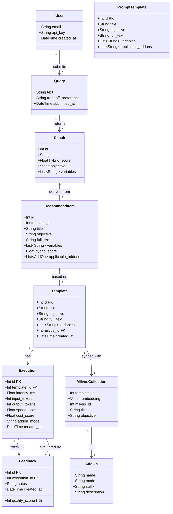


---

## 2. Data Flow Diagram (DFD) - Level 0

Context diagram showing the entire Promptee system as a single process with external entities.

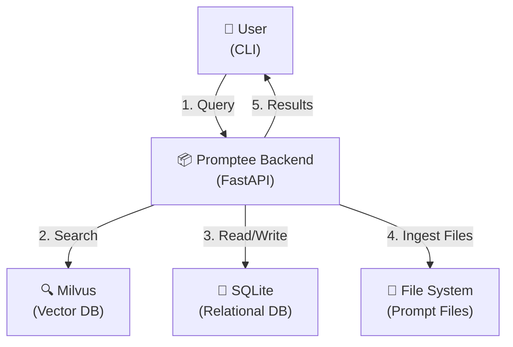

---

## 3. Data Flow Diagram (DFD) - Level 1

Detailed decomposition showing the main processes and data flows within Promptee.

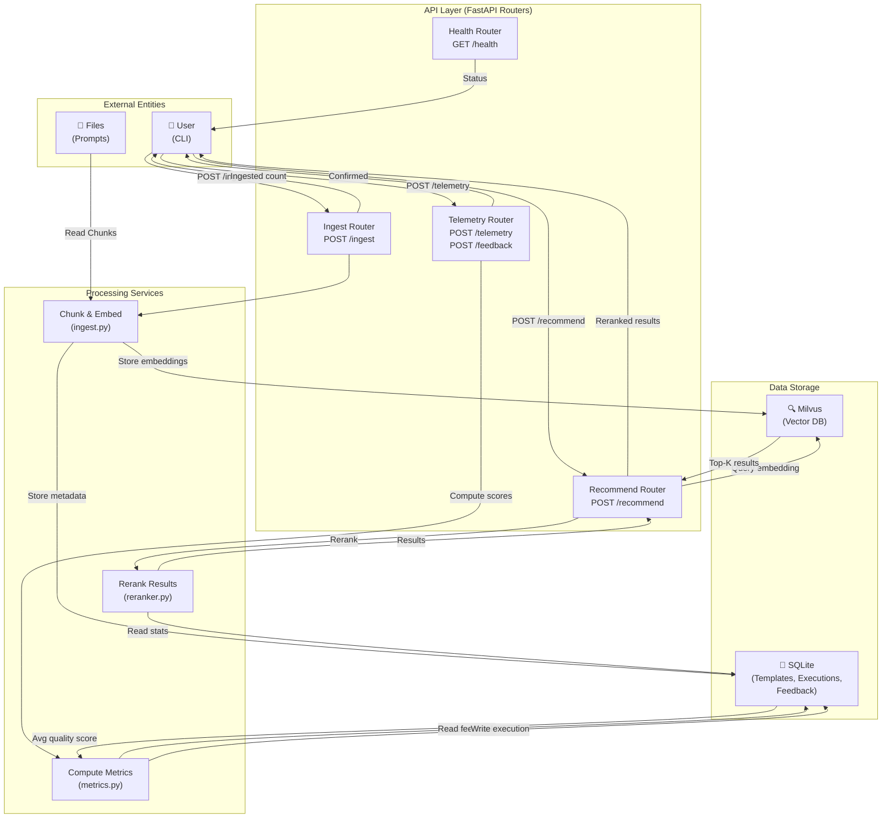

---

## 4. Data Flow Diagram (DFD) - Level 1 Detailed Process Flows

### Process 1: Ingest Pipeline
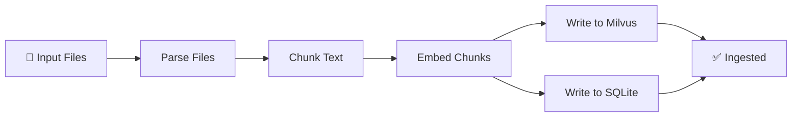

### Process 2: Recommendation Pipeline
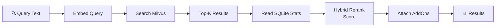

### Process 3: Telemetry & Feedback Pipeline
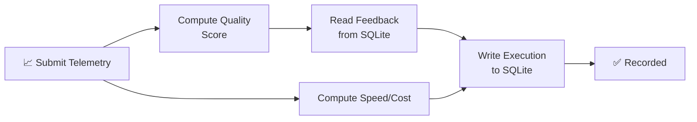

---

## 5. Use Case Diagram - Level 1

High-level use cases showing interactions between user and system.

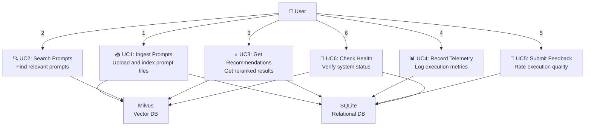

---

## 6. Use Case Diagram - Level 2a: Ingest & Recommendation Flows

Detailed workflows for ingest and recommendation operations.

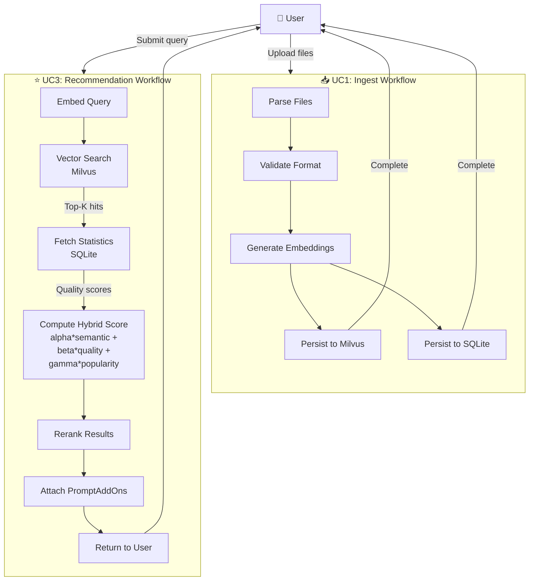

---

## 6. Use Case Diagram - Level 2b: Telemetry, Feedback & Health

Detailed workflows for telemetry, feedback, and health check operations.

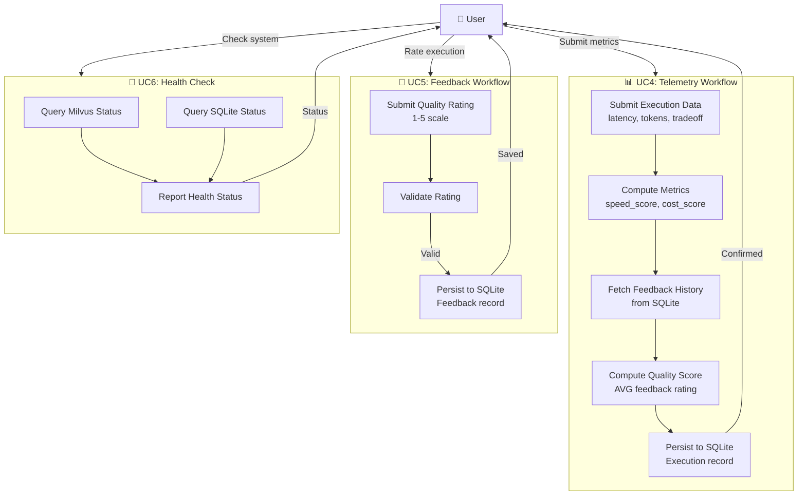

---

## 7. System Integration Points

### Data Model Relationships
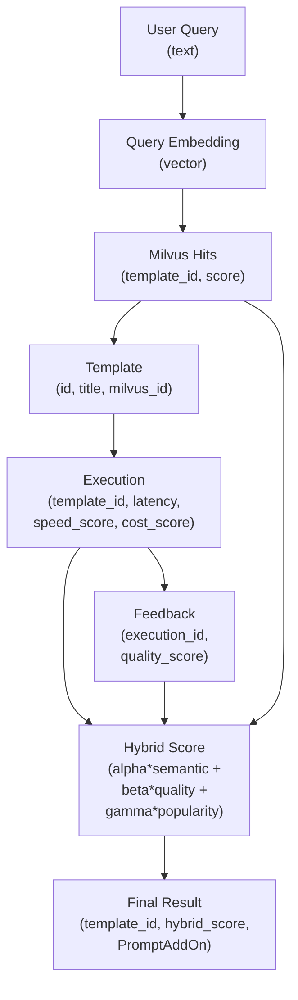

---

## 8. Architecture Summary

| Component | Technology | Purpose | Key Tables/Collections |
|-----------|-----------|---------|----------------------|
| **API Gateway** | FastAPI + uvicorn | Request routing, validation | N/A |
| **Vector Database** | Milvus 2.3.3 | Semantic search on embeddings | Collections with `template_id` metadata |
| **Relational Database** | SQLite (aiosqlite) | Execution telemetry, feedback, templates | `templates`, `executions`, `feedback` |
| **Embedding Model** | Configurable (default: all-minilm) | Convert text to vectors | N/A |
| **Reranking** | Hybrid algorithm (alpha/beta/gamma) | Combine semantic + quality scores | Reads from SQLite, uses Milvus scores |
| **CLI** | Go + tooey + tsuey | User interface, terminal rendering | N/A (reads from FastAPI) |

---

## 9. Phase Progression Map

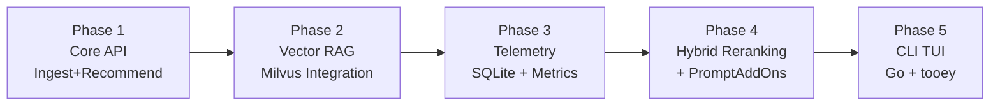

---

---

## 10. Comprehensive Backend Architecture (APIs, Databases & Relations)

Detailed view of all backend routers, services, databases, and their interactions.

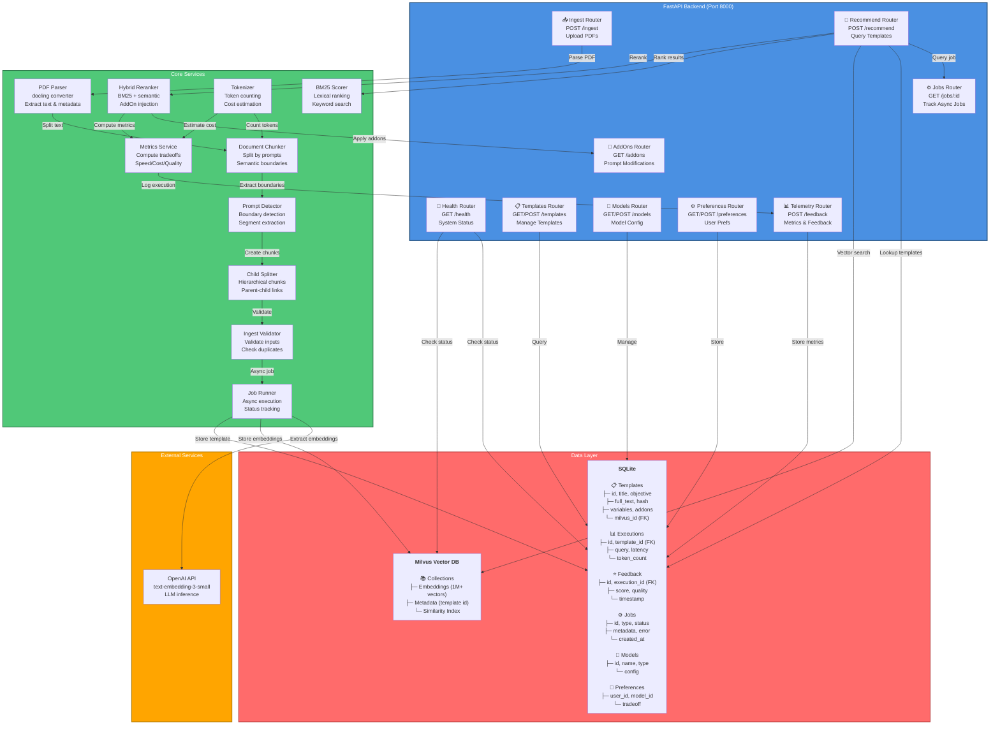

---

## 11. Frontend & API Integration Diagram

Shows how the Go TUI communicates with the FastAPI backend through HTTP.

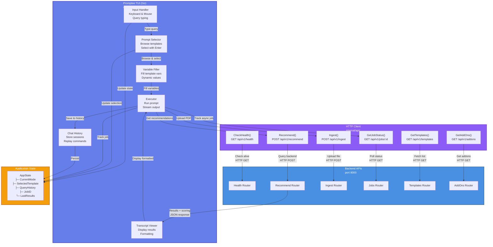

---

## 12. Complete End-to-End Workflow Sequence Diagram

Shows the full interaction sequence from user starting app through getting recommendations.

```mermaid
sequenceDiagram
    actor User
    participant TUI as Promptee TUI
    participant APIClient as HTTP Client
    participant Backend as FastAPI Backend
    participant Jobs as Job Runner
    participant Parser as PDF Parser
    participant Chunker as Document Chunker
    participant Milvus as Milvus Vector DB
    participant SQLite as SQLite
    participant OpenAI as OpenAI API

    User->>TUI: 1. Start app
    TUI->>APIClient: CheckHealth()
    APIClient->>Backend: GET /api/v1/health
    Backend->>Backend: Verify DBs
    Backend-->>APIClient: 200 OK
    APIClient-->>TUI: Connected

    User->>TUI: 2. Upload PDF
    TUI->>APIClient: Ingest(file)
    APIClient->>Backend: POST /api/v1/ingest
    Backend->>Jobs: Create async job_id
    Backend-->>APIClient: {job_id}
    APIClient-->>TUI: Job started

    Jobs->>Parser: Parse PDF
    Parser->>Parser: Extract text + metadata
    Parser->>Chunker: Split by boundaries
    Chunker->>Chunker: Extract prompts
    Chunker->>SQLite: Store templates
    SQLite-->>Chunker: template_ids

    Chunker->>OpenAI: Generate embeddings
    OpenAI-->>Chunker: Vector embeddings
    Chunker->>Milvus: Store vectors
    Milvus-->>Chunker: Confirmed
    
    Jobs->>SQLite: Mark job COMPLETED
    
    TUI->>APIClient: Poll GetJobStatus(job_id)
    APIClient->>Backend: GET /api/v1/jobs/{job_id}
    Backend->>SQLite: Fetch job status
    SQLite-->>Backend: COMPLETED
    Backend-->>APIClient: Status OK
    APIClient-->>TUI: Job done!

    User->>TUI: 3. Type query
    TUI->>TUI: Display templates
    User->>TUI: Select template
    TUI->>TUI: Show variables
    User->>TUI: Fill variables
    
    User->>TUI: 4. Execute prompt
    TUI->>APIClient: Recommend(query, vars)
    APIClient->>Backend: POST /api/v1/recommend
    
    Backend->>Milvus: Semantic search
    Milvus-->>Backend: Top-k similar vectors
    Backend->>SQLite: Fetch template data
    SQLite-->>Backend: Templates + metadata
    
    Backend->>Backend: BM25 lexical ranking
    Backend->>Backend: Rerank (hybrid)
    Backend->>Backend: Inject addons
    Backend->>Backend: Compute metrics
    
    Backend-->>APIClient: Results + scores
    APIClient-->>TUI: Recommendations

    TUI->>TUI: Format results
    TUI->>Transcript: Display with syntax highlighting
    Transcript-->>TUI: Rendered view
    TUI-->>User: Show results

    User->>TUI: 5. Provide feedback
    TUI->>APIClient: SendFeedback(score)
    APIClient->>Backend: POST /api/v1/feedback
    Backend->>SQLite: Store feedback
    SQLite-->>Backend: Confirmed
    Backend-->>APIClient: 200 OK
    APIClient-->>TUI: Saved

    TUI->>History: Store session
    History-->>TUI: Persisted

    style User fill:#FFD700
    style TUI fill:#667EEA,color:#fff
    style APIClient fill:#8B5CF6,color:#fff
    style Backend fill:#4A90E2,color:#fff
    style Jobs fill:#50C878,color:#fff
    style Parser fill:#50C878,color:#fff
    style Chunker fill:#50C878,color:#fff
    style Milvus fill:#FF6B6B,color:#fff
    style SQLite fill:#FF6B6B,color:#fff
    style OpenAI fill:#FFA500,color:#fff
```

---

## Notes

- **Cross-Database Reference**: `Template.milvus_id` (SQLite) stores the Milvus vector ID for potential bidirectional lookups
- **Async Throughout**: All database operations use async/await (FastAPI lifespan, async SQLAlchemy sessions, asyncio context managers)
- **Two-Phase Ingest**: SQLite Template row created first (gets PK), then Milvus insert (gets Milvus ID), then SQLite backfill of `milvus_id`
- **Tradeoff Scoring**: User's `tradeoff_preference` (balanced/speed/cost/quality) adjusts alpha/beta/gamma weights in hybrid reranking
- **PromptAddOns**: System-level templates that can be attached to results based on detected patterns or user preferences
- **Job Queue**: Async PDF ingest uses job runner for long-running operations with status polling from TUI
- **Hybrid Search**: Combines semantic similarity (Milvus) + BM25 lexical ranking + quality feedback scores
- **Stateful TUI**: Application state tracks current mode, selected template, query history, and active job IDs
