# Promptee (Daedalus) System Architecture Diagrams

## 1. Class Diagram

Shows all entities, their attributes, and relationships in the Promptee system.

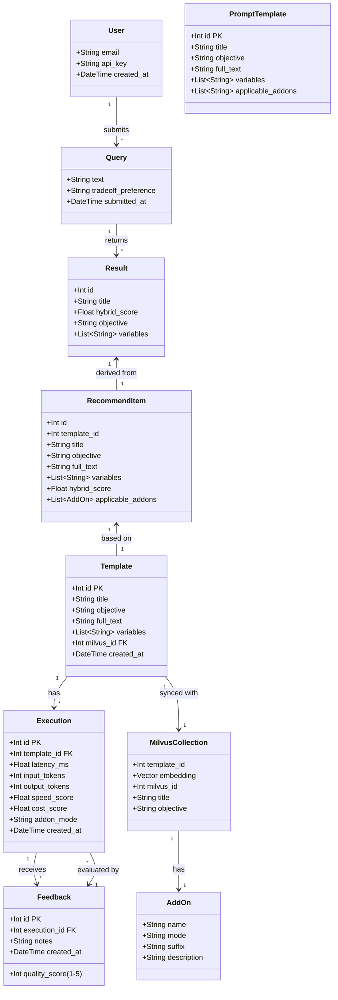

---

## 2. Data Flow Diagram (DFD) - Level 0

Context diagram showing the entire Promptee system as a single process with external entities.

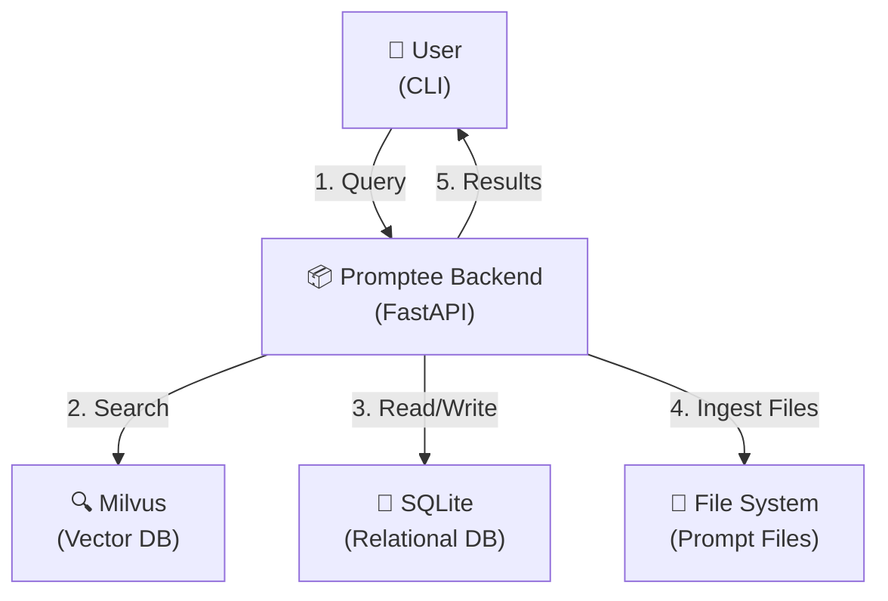

---

## 3. Data Flow Diagram (DFD) - Level 1

Detailed decomposition showing the main processes and data flows within Promptee.

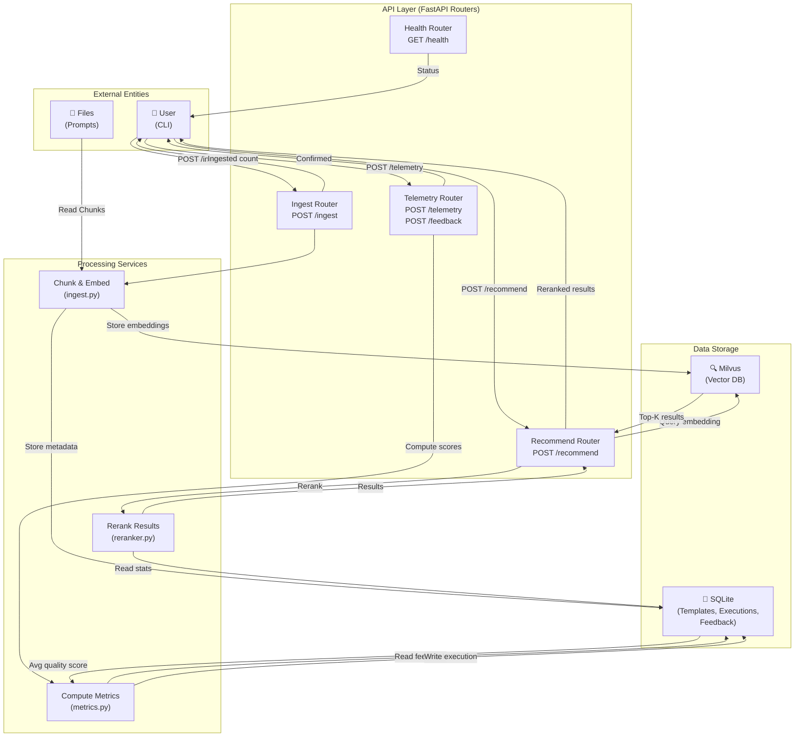

---

## 4. Data Flow Diagram (DFD) - Level 1 Detailed Process Flows

### Process 1: Ingest Pipeline
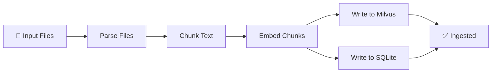

### Process 2: Recommendation Pipeline
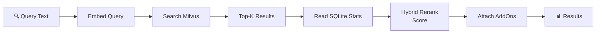

### Process 3: Telemetry & Feedback Pipeline
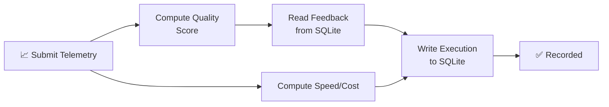

---

## 5. Use Case Diagram - Level 1

High-level use cases showing interactions between user and system.

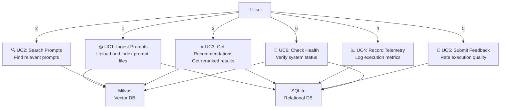

---

## 6. Use Case Diagram - Level 2a: Ingest & Recommendation Flows

Detailed workflows for ingest and recommendation operations.

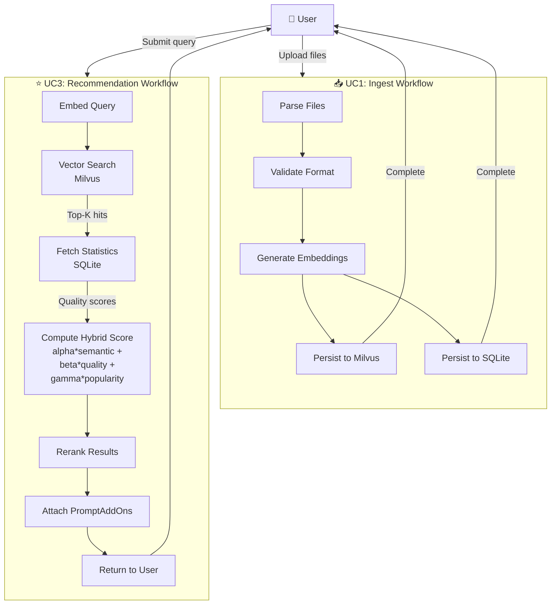

---

## 6. Use Case Diagram - Level 2b: Telemetry, Feedback & Health

Detailed workflows for telemetry, feedback, and health check operations.

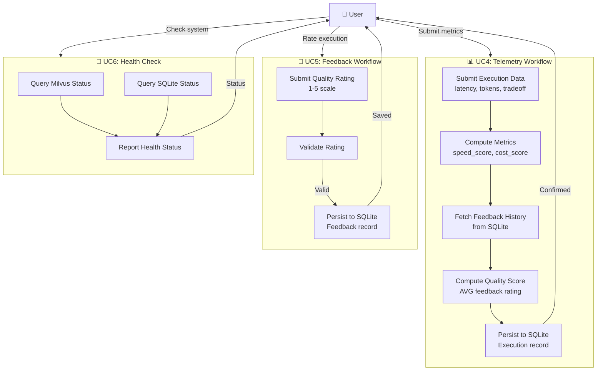

---

## 7. System Integration Points

### Data Model Relationships
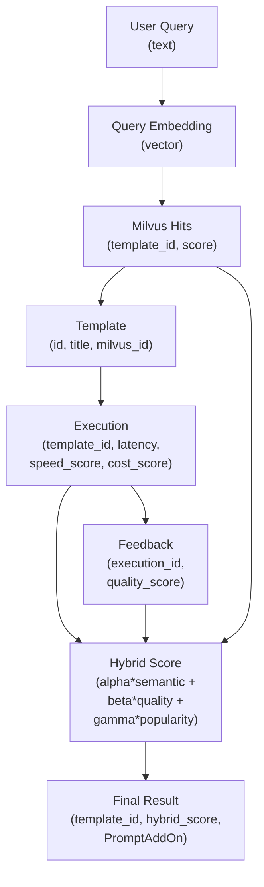

---

## 8. Architecture Summary

| Component | Technology | Purpose | Key Tables/Collections |
|-----------|-----------|---------|----------------------|
| **API Gateway** | FastAPI + uvicorn | Request routing, validation | N/A |
| **Vector Database** | Milvus 2.3.3 | Semantic search on embeddings | Collections with `template_id` metadata |
| **Relational Database** | SQLite (aiosqlite) | Execution telemetry, feedback, templates | `templates`, `executions`, `feedback` |
| **Embedding Model** | Configurable (default: all-minilm) | Convert text to vectors | N/A |
| **Reranking** | Hybrid algorithm (alpha/beta/gamma) | Combine semantic + quality scores | Reads from SQLite, uses Milvus scores |
| **CLI** | Go + tooey + tsuey | User interface, terminal rendering | N/A (reads from FastAPI) |

---

## 9. Phase Progression Map

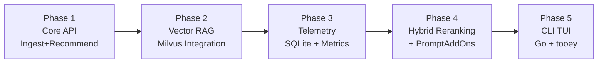

---

## 10. Backend Architecture — APIs, Services & Databases

All routers, processing services, and data stores with their relationships.

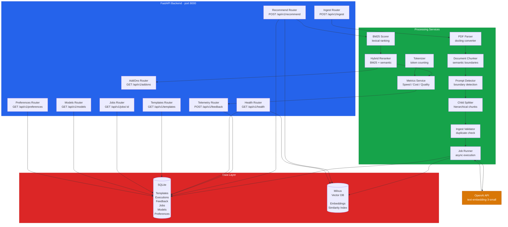

---

## 11. Frontend & API Integration

How the Go TUI talks to the FastAPI backend via HTTP.

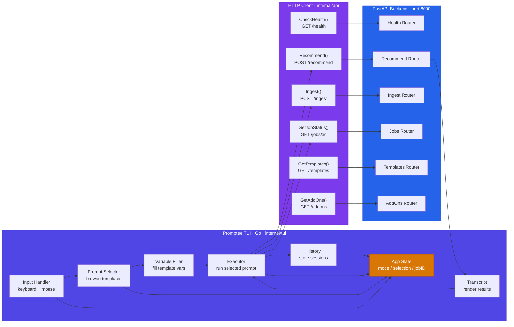

---

## 12. End-to-End Workflow Sequence

Complete interaction from app startup through recommendation and feedback.

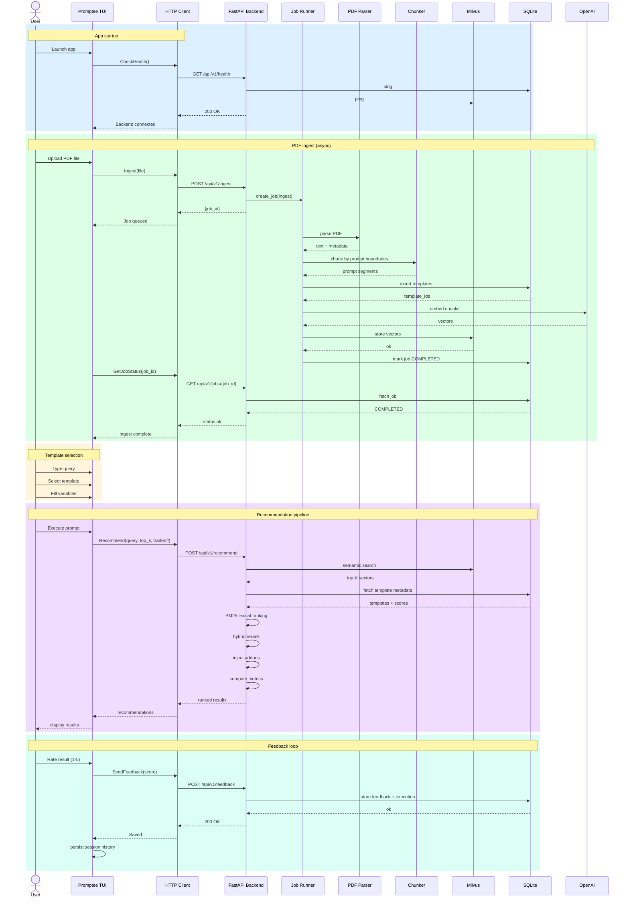

---

## Notes

- **Cross-Database Reference**: `Template.milvus_id` (SQLite) bridges to the Milvus vector ID for bidirectional lookups
- **Async Throughout**: All database operations use async/await (FastAPI lifespan, aiosqlite, asyncio)
- **Two-Phase Ingest**: SQLite Template row created first (gets PK) → Milvus insert → SQLite backfill of `milvus_id`
- **Tradeoff Scoring**: `tradeoff_preference` (balanced / speed / cost / quality) tunes α/β/γ weights in hybrid reranking
- **PromptAddOns**: System-level suffixes injected into results based on detected patterns or user preferences
- **Job Queue**: Long-running PDF ingest runs in background; TUI polls `/jobs/:id` for completion
- **Hybrid Search**: Semantic similarity (Milvus) + BM25 lexical score + quality feedback combined per tradeoff weights
- **Stateful TUI**: App state tracks current mode, selected template, query history, and active job IDs
